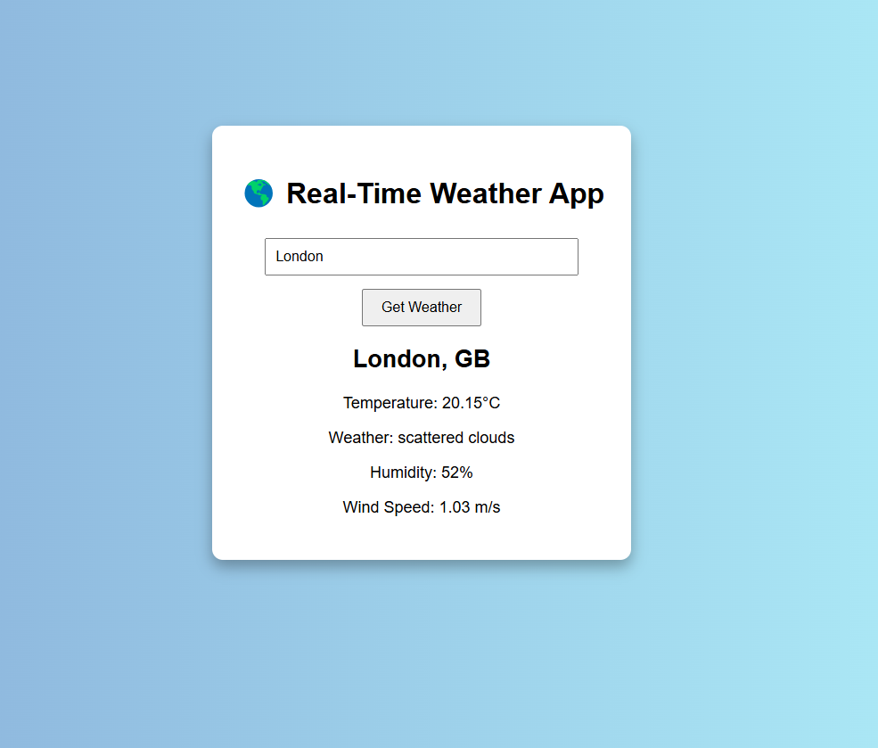

# 🌎 Real-Time Weather App

This is a simple, responsive web application that fetches and displays **real-time weather data** for cities around the world using the **OpenWeather API**.

## 📸 Project Screenshot



## 🛠️ Built With

- HTML
- CSS
- JavaScript (Vanilla)
- OpenWeather API

## ✨ Features

- Search for any city worldwide.
- Display real-time:
  - Temperature
  - Weather conditions (e.g., Clear, Rain, Clouds)
  - Humidity percentage
  - Wind speed
- Clean and simple user interface.

## 📚 How to Use

1. Clone the repository:

   ```bash
   git clone https://github.com/Tks23-hub/real-time-weather-app.git
   ```
